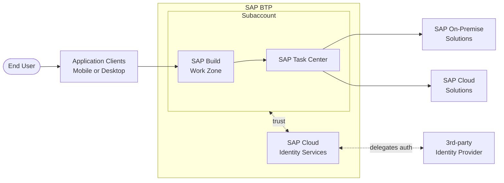

```mermaid
flowchart LR
    EU([End User])
    AC[Application Clients<br/>Mobile or Desktop]
    IDP[3rd-party<br/>Identity Provider]
    ONPREM[SAP On-Premise<br/>Solutions]
    CLOUD[SAP Cloud<br/>Solutions]

    subgraph BTP[SAP BTP]
        CIS[SAP Cloud<br/>Identity Services]
        subgraph SUB[Subaccount]
            BWZ[SAP Build<br/>Work Zone]
            TC[SAP Task Center]
        end
    end

    EU --> AC
    AC --> BWZ
    BWZ --> TC
    TC --> ONPREM
    TC --> CLOUD
    SUB <-. trust .-> CIS
    CIS <-. delegates auth .-> IDP
```
