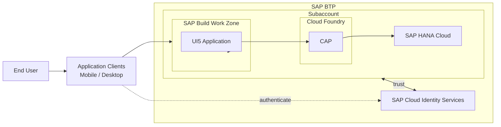

```mermaid
flowchart LR
    EndUser[End User]
    Clients[Application Clients<br/>Mobile / Desktop]

    subgraph BTP[SAP BTP]
        IAS[SAP Cloud Identity Services]
        subgraph SA[Subaccount]
            subgraph BWZ[SAP Build Work Zone]
                UI5[UI5 Application]
            end
            subgraph CF[Cloud Foundry]
                CAP[CAP]
            end
            HANA[SAP HANA Cloud]
        end
    end

    EndUser --> Clients
    Clients --> BWZ
    BWZ --> UI5
    UI5 --> CAP
    CAP --> HANA
    SA <-->|trust| IAS
    Clients -.->|authenticate| IAS
```
