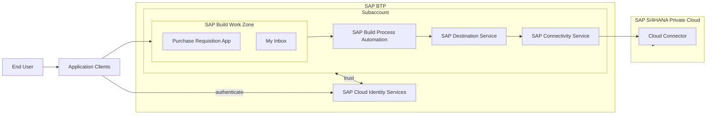

```mermaid
graph LR
    EU[End User]
    AC[Application Clients]

    subgraph BTP["SAP BTP"]
        subgraph SA["Subaccount"]
            subgraph BWZ["SAP Build Work Zone"]
                UI5[Purchase Requisition App]
                INBOX[My Inbox]
            end
            SPA[SAP Build Process Automation]
            DEST[SAP Destination Service]
            CONN[SAP Connectivity Service]
        end
        CIS[SAP Cloud Identity Services]
    end

    subgraph S4["SAP S/4HANA Private Cloud"]
        CC[Cloud Connector]
    end

    %% Main flow
    EU --> AC
    AC --> BWZ
    BWZ --> SPA
    SPA --> DEST
    DEST --> CONN
    CONN --> CC
    CC --> S4

    %% Authentication & trust
    SA <-->|trust| CIS
    AC -->|authenticate| CIS
```
